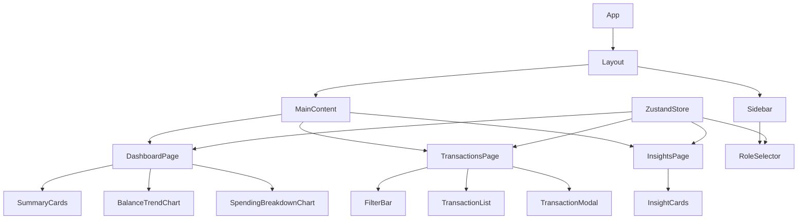

# Design Document: Finance Dashboard UI

## Overview

A single-page React application that gives users a clear view of their financial activity. It uses mock/static data seeded at startup, supports Admin and Viewer roles switchable via a dropdown, and persists state to localStorage. The stack is React 18 + TypeScript + Tailwind CSS + Recharts + Zustand.

Key design decisions:
- **Recharts** for charts: React-native composable API, SVG-based, responsive out of the box — ideal for dashboards ([source](https://www.webstackzone.com/blog/what-is-recharts-and-comparison))
- **Zustand** for state: lightweight, no boilerplate, avoids Context re-render issues for frequently-updated global state ([source](https://tkdodo.eu/blog/zustand-and-react-context))
- **Tailwind CSS** for styling: utility-first, responsive breakpoints built in, no CSS file overhead
- **TypeScript** throughout for type safety and maintainability

---

## Architecture



The app is a client-side SPA with no router dependency — navigation is handled by a simple `activePage` state in the store. All shared state lives in a single Zustand store. Components read from and write to the store directly.

---

## Components and Interfaces

### Layout
- `App.tsx` — root, renders `<Layout>`
- `Layout.tsx` — sidebar + main content area, responsive (sidebar collapses to top nav on mobile)
- `Sidebar.tsx` — navigation links + `RoleSelector`

### Navigation
- `RoleSelector.tsx` — dropdown to switch between `"admin"` and `"viewer"` roles

### Dashboard Page (`pages/DashboardPage.tsx`)
- `SummaryCards.tsx` — renders three `SummaryCard` components (Total Balance, Income, Expenses)
- `SummaryCard.tsx` — single metric card with label, value, and trend icon
- `BalanceTrendChart.tsx` — Recharts `LineChart` showing monthly net balance over time
- `SpendingBreakdownChart.tsx` — Recharts `PieChart` showing expense totals by category

### Transactions Page (`pages/TransactionsPage.tsx`)
- `FilterBar.tsx` — search input, type filter (All/Income/Expense), category filter dropdown, sort selector
- `TransactionList.tsx` — renders list of `TransactionRow` components
- `TransactionRow.tsx` — single row: date, description, category badge, amount (color-coded), edit button (Admin only)
- `TransactionModal.tsx` — add/edit form modal (Admin only): date, description, amount, category, type fields

### Insights Page (`pages/InsightsPage.tsx`)
- `InsightCard.tsx` — reusable card for a single insight with icon, label, and value
- Renders: highest spending category, month-over-month comparison, average monthly expense

### Shared
- `EmptyState.tsx` — reusable empty state component with icon and message
- `Badge.tsx` — category or type badge pill

---

## Data Models

```typescript
type TransactionType = "income" | "expense";

type Category =
  | "Salary"
  | "Food"
  | "Rent"
  | "Entertainment"
  | "Transport"
  | "Healthcare"
  | "Shopping"
  | "Utilities"
  | "Other";

interface Transaction {
  id: string;           // uuid
  date: string;         // ISO date string "YYYY-MM-DD"
  description: string;
  amount: number;       // always positive
  type: TransactionType;
  category: Category;
}

type Role = "admin" | "viewer";

interface FilterState {
  search: string;
  type: TransactionType | "all";
  category: Category | "all";
  sortBy: "date-desc" | "date-asc" | "amount-desc" | "amount-asc";
}

interface AppState {
  transactions: Transaction[];
  role: Role;
  filters: FilterState;
  activePage: "dashboard" | "transactions" | "insights";
  // actions
  addTransaction: (t: Omit<Transaction, "id">) => void;
  updateTransaction: (id: string, t: Partial<Transaction>) => void;
  setRole: (role: Role) => void;
  setFilters: (filters: Partial<FilterState>) => void;
  setActivePage: (page: AppState["activePage"]) => void;
}
```

### Derived / Computed Values (pure functions, not stored)

```typescript
// Summary card values
function getTotalBalance(transactions: Transaction[]): number
function getTotalIncome(transactions: Transaction[]): number
function getTotalExpenses(transactions: Transaction[]): number

// Chart data
function getMonthlyTrend(transactions: Transaction[]): MonthlyDataPoint[]
// MonthlyDataPoint: { month: string, income: number, expenses: number, balance: number }

function getSpendingByCategory(transactions: Transaction[]): CategoryDataPoint[]
// CategoryDataPoint: { category: string, total: number }

// Insights
function getHighestSpendingCategory(transactions: Transaction[]): { category: string; total: number } | null
function getMonthOverMonthChange(transactions: Transaction[]): { current: number; previous: number; delta: number; direction: "up" | "down" | "same" }
function getAverageMonthlyExpense(transactions: Transaction[]): number

// Filtered + sorted transactions
function applyFilters(transactions: Transaction[], filters: FilterState): Transaction[]
```

### Mock Data

Seed data: ~20 transactions spanning 3 months, covering all categories and both types. Loaded as a constant and used as Zustand initial state.

---

## Correctness Properties

A property is a characteristic or behavior that should hold true across all valid executions of a system — essentially, a formal statement about what the system should do. Properties serve as the bridge between human-readable specifications and machine-verifiable correctness guarantees.

### Property 1: Balance invariant

*For any* list of transactions, `getTotalBalance` should equal `getTotalIncome` minus `getTotalExpenses`, and `getTotalIncome` plus `getTotalExpenses` should account for every transaction in the list (no transaction is silently dropped from aggregation).

**Validates: Requirements 1.1, 1.2, 1.3**

---

### Property 2: Filter correctness

*For any* transaction list and any combination of type filter, category filter, and search term, `applyFilters` should return a list where every transaction satisfies all active filter conditions simultaneously, and the result length is less than or equal to the original list length.

**Validates: Requirements 2.2, 2.3, 2.4**

---

### Property 3: Sort produces a valid ordering

*For any* transaction list and sort option, `applyFilters` with that sort option should return a list where adjacent elements satisfy the sort predicate (i.e., the list is correctly ordered by the chosen field and direction).

**Validates: Requirements 2.5**

---

### Property 4: Add transaction round trip

*For any* valid transaction object, after calling `addTransaction`, the store's transaction list should contain a transaction with matching fields (description, amount, type, category, date).

**Validates: Requirements 3.5**

---

### Property 5: Role-based UI visibility

*For any* application state, when the role is `"viewer"`, add and edit controls should not be present in the rendered output; when the role is `"admin"`, both add and edit controls should be present.

**Validates: Requirements 3.2, 3.3, 3.4**

---

### Property 6: Highest spending category consistency

*For any* transaction list with at least one expense transaction, `getHighestSpendingCategory` should return the category whose total in `getSpendingByCategory` is the maximum value across all categories.

**Validates: Requirements 4.1**

---

### Property 7: Monthly trend coverage

*For any* transaction list, every distinct year-month string present in the transactions should appear as a data point in `getMonthlyTrend`, and no extra months should be fabricated.

**Validates: Requirements 1.4**

---

### Property 8: Average monthly expense computation

*For any* transaction list with at least one expense, `getAverageMonthlyExpense` should equal the total expenses divided by the number of distinct months that contain at least one expense transaction.

**Validates: Requirements 4.3**

---

### Property 9: Filter state persists across navigation

*For any* filter state set by the user, changing `activePage` in the store should leave the `filters` object unchanged.

**Validates: Requirements 5.4**

---

### Property 10: LocalStorage round trip

*For any* store state (transactions + role), serializing to localStorage and re-initializing the store from localStorage should produce a store with equivalent transactions and role.

**Validates: Requirements 5.5**

---

## Error Handling

| Scenario | Behavior |
|---|---|
| Empty transaction list | All summary cards show `$0.00`, charts show empty state message, insights show placeholder text |
| No transactions match filters | `TransactionList` renders `<EmptyState>` with "No transactions match your filters" |
| Admin submits form with missing fields | Inline validation errors shown per field, form not submitted |
| Admin submits form with non-numeric amount | Validation error: "Amount must be a positive number" |
| localStorage unavailable (e.g., private browsing) | App falls back to in-memory state silently, no crash |

---

## Testing Strategy

### Dual Testing Approach

Both unit tests and property-based tests are used. They are complementary:
- Unit tests catch specific known bugs and edge cases
- Property-based tests verify universal correctness across many generated inputs

### Unit Tests (Vitest)

Focus areas:
- `applyFilters`: specific filter combinations, empty list, all-filter combinations
- `getTotalBalance`, `getTotalIncome`, `getTotalExpenses`: known transaction sets
- `getHighestSpendingCategory`: tie-breaking, single category, empty list
- `getMonthOverMonthChange`: same month, no previous month, increase vs decrease
- Form validation logic: empty fields, negative amounts, zero amounts
- Role-based rendering: Admin controls visible/hidden based on role

### Property-Based Tests (fast-check)

[fast-check](https://github.com/dubzzz/fast-check) is the chosen PBT library for TypeScript/React. It integrates with Vitest and provides rich arbitrary generators.

Each property test runs a minimum of 100 iterations.

Tag format: `// Feature: finance-dashboard-ui, Property N: <property text>`

| Property | Test Description |
|---|---|
| Property 1 | Generate random transaction lists → assert balance = income − expenses, and all transactions are accounted for |
| Property 2 | Generate random transactions + filter combinations → assert all results satisfy all active filters |
| Property 3 | Generate random transactions + sort option → assert result is correctly ordered |
| Property 4 | Generate random valid transaction → add to store → assert it appears in list with matching fields |
| Property 5 | Generate random role value → assert add/edit controls visible iff role is admin |
| Property 6 | Generate random expense transactions → assert highest category matches max of category totals |
| Property 7 | Generate random transaction lists → assert monthly trend covers all distinct months, no extras |
| Property 8 | Generate random expense transactions → assert average = total / distinct months |
| Property 9 | Generate random filter state + page change → assert filters unchanged after navigation |
| Property 10 | Generate random store state → serialize to localStorage → re-init → assert equivalent state |

### Test File Structure

```
src/
  utils/
    finance.ts          ← pure computation functions
    finance.test.ts     ← unit + property tests for all pure functions
  store/
    useStore.ts         ← Zustand store
    useStore.test.ts    ← unit tests for store actions
  components/
    TransactionModal/
      TransactionModal.test.tsx  ← form validation tests
```
